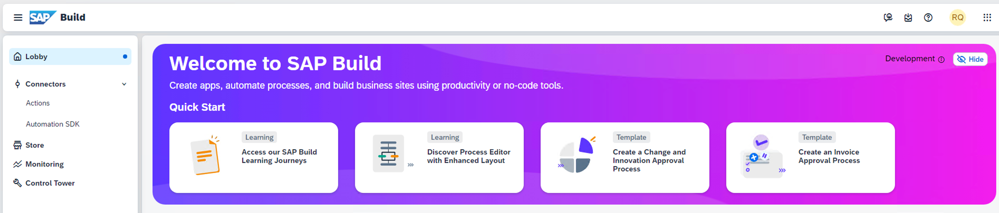

# Getting Started - Preparation
---
Let's start the exercise and check if everything is ready to go.
Please make sure you have completed all the necessary prerequisites listed below. If not, please raise your voice so that we can assist you early in the session.

## Prerequisites
Please keep the following links and resources available:

1. Make sure you have access to a browser, preferably Google Chrome.
2. Log on to the Development Lobby  

4.  If you will deploy all the the artifacts to the same SAP BTP account, and having different names and identifiers is important to avoid clashes. please use a reference to your **XXX** number. Make sure that you remember it well.

## General troubleshooting

1. If you encounter an issue in SAP Business Application Studio, you can check the logs under: **File > Open > /home/user/lcap.home.2023-11-02.log** (If you encounter the issue any other day, you need to update the file name with the date of that day.)

2. If something does not work in the editor, restart the whole workspace. To do so, open URL like this: **https://lcapteched.eu10cf.applicationstudio.cloud.sap/index.html**.  
The Dev Space Manager appears, showing the SAP Business Application Studio dev spaces. Click the "Stop" button, and once the dev space is stopped, you can simply restart it.

