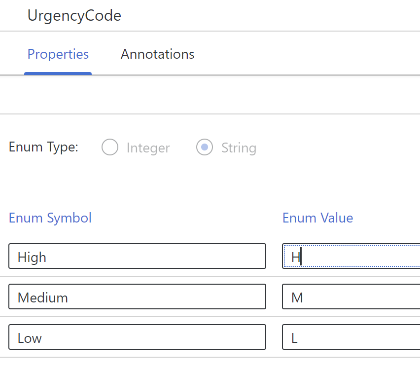

# Exercise 1 - Create a  New Project and Create a Data Model
---
In this exercise, we will create an **incident_management** project in the new low-code perspective in SAP Business Application Studio.

Open your browser and launch the landing page, the "lobby".

A login page is opened, enter the credentials provided to you for the session.

You should see the central entry point for SAP Build development in SAP BTP.

The "lobby" may already contain multiple projects created in this account.

Click **Create** and select the **Build an Application** tile. 

On the next screen, select the **SAP Build Code** tile.

Then, select the **Full-Stack Application** tile.

A dialog appears where you can enter the following name for your project. As we plan to deploy our project, it is important to stick to the naming convention here.  

**DO NOT USE YOUR OWN PROJECT NAME**  

You must name your project `incident_managementXXX`, where XXX is the user number that was assigned to you. Please make sure that you received a user number that was assigned to you by the speakers/moderators. Don't make up your own number to avoid clashes with the deployments of others. If your user number is **007** your project name should be **incident_management007**

Fill in the fields as shown below:
1. **Namespace**:	teched
2. **Service Name**:	Processor
   
You can provide any descriptive text that you want.  
Confirm by clicking **Create**. 

The project creation may last 2-3 minutes.

From the list of projects, select **incident_managementXXX** and navigate to the storyboard in SAP Business Application Studio.

After SAP Business Application Studio has created your environment, you should see a screen like this. (Depending on whether your dev space has already started, this might take several minutes to open.)

Now, we can build our project and use SAP-opinionated technologies, such as CAP (Cloud Application Programming Model) and SAP Fiori elements, without thinking about how to structure our project. We can concentrate on the tasks to perform rather than spending time on thinking about project setup and wiring up technologies.

In the next step, we will create a data model.

## Summary

You've now created an incident management project with a default **Processor** service that is ready for modeling, based on CAP (Cloud Application Programming model).

---

 

In the following exercise, we will use the new high productivity tools in SAP Business Application Studio to create a data model that persists our business data. You will expose the data as an OData service for our consuming applications later on.

##### Import CodeList to the Data Model

In the storyboard, click on **teched** under the **Data Models** tile, and click **Open in Graphical Modeler**. The CDS Graphical Modeler opens.

From the CDS Graphical Modeler editor's **double click** on the empty canvas, or from the top right toolbar click on the **Show Details** icon.

Click the **Import** tab, click **+** (Import from other models), and select **Common Types**.
From the dialog box, select the **sap.common.CodeList** checkbox, and leave the other default options.

The data type is imported to the model. It will be used later as a property in the **Urgency** entity.

##### Add the Incidents Entity
Create the **Incidents** entity including properties and annotations.

In the CDS Graphical Modeler, click **Add Entity**, and then click on the canvas.
Change the tile's title to **Incidents**.
Note that the ID property as a key is already created for you for convenience. 
We leave it as is.

Click the **Show Details** icon. A new Incidents editor opens on the right-hand side.

In the Incidents editor, click the **Properties** tab, and then click **+** (Add property).

For the **Name** column, enter **title** for the value.

For the rest of the columns, leave the default values.

The entity is updated with the new property.

In the Incidents editor, click the **Annotations** tab.

Click  **+** (Add) next to the **title** row.

1. For the **Annotation Target**, select **title** from the dropdown list.
2. For the **Annotation Value**, enter **Title**.
   
The entity is updated with the new annotations.

##### Add the Conversations Entity
Create the **Conversations** entity including its properties, annotations, and aspects.

In the CDS Graphical Modeler, click **Add Entity**, and then click on the canvas.
Change the tile's title to **Conversations**.

In the **Conversations** editor, click the **Properties** tab. (If the editor is not already open, click the **Show Details** icon on the entity.)

Click **+** (Add property) for each of the fields below:
1. For the **Name** column, enter **timestamp**. For the **Type** column, enter **DateTime**.
For the rest of the columns, leave the default values
2. For the **Name** column, enter **author**.
For the rest of the columns, leave the default values
3. For the **Name** column, enter **message**.
For the rest of the columns, leave the default values.

The entity is updated with the new properties.

In the Conversation editor, click the **Annotations** tab.

   
Click **+** (Add) next to the **timestamp**.
1. For the **Annotation Target**, select **cds.on.insert** from the dropdown list.
2. For the **Annotation Value**, select **$now** from the dropdown list.

Click **+** (Add) next to the **author** row.
1. For the **Annotation Target**, select **cds.on.insert** from the dropdown list.
2. For the **Annotation Value**, select **$user** from the dropdown list.
The entity is updated with the new annotations.

##### Add the UrgencyCode Enum

In the CDS Graphical Modeler, click **+**, select **Add Enum** from the dropdown list, and then click on the canvas. 
Change the tile's title to **UrgencyCode**.

If it is not already open, click the **Show Details** icon to open the **UrgencyCode** editor on the right-hand side.

In the UrgencyCode editor, click the **Properties** tab.
1. Select the **String** radio button.
2. For the **Enum Symbol** column, enter **High**.
3. For the **Enum Value** column, enter **H**.
4. Click **+** (Add enum symbol).   
5. For the **Enum Symbol** column, enter **Medium**.
6. For the **Enum Value** column, enter **M**.
7. Click **+** (Add enum symbol).   
8. For the **Enum Symbol** column, enter **Low**.
9. For the **Enum Value** column, enter **L**.
    
The UrgencyCode entity is updated with the new properties.

##### Add the Urgency Entity
Create the Urgency entity based on the UrgencyCode Enum, and add the CodeList aspect.

In the CDS Graphical Modeler, click **Add Entity**.
Change the tile's title to **Urgency**.
Again, the **ID** property is created for you. However, this time we will change it.

Click on the **Show Details** icon. A new Urgency editor opens on the right-hand side.
In the Urgency editor, click the **Properties** tab.

1. Change the **ID** property to **code**.
3. Change the **UUID** type, to the previously created **UrgencyCode**.
3. For the rest of the columns, leave the default values.

The entity is updated with the new property.

In the Urgency editor, click the **Aspects** tab.

Select the **sap.common.CodeList** aspect checkbox.

The entity is updated with the new aspect.

##### Add the Entity Relationship

Create associations between **Incidents** and both **Conversations** and **Urgency**. An incident includes urgency, and multiple conversations.

1. Select the **Incidents** entity and click the **Add Relationship** icon.
2. An arrow appears. Drag the arrow to the **Conversations** entity.
The **New Relationship** dialog box opens.
In the dialog box, fill in the following values:
   1. For **Type**, select **Composition**.
   2. For **Multiplicity**, select **To-Many**.
   3. For the rest of the fields, leave the default values.
   4. Click **Create**.
   
The Incidents entity is updated with the new relationship to Conversations.

1. Select the Incidents entity and click the **Add Relationship** icon.
2. An arrow appears. Drag the arrow to the **Urgency** entity.
The **New Relationship** dialog box opens.
In the dialog box, fill in the following values:
   1. For **Type**, select **Association**.
   2. For **Multiplicity**, select **To-One**.
   3. **IMPORTANT**: for  **Direction** select **Unidirectional**.
   4. For the rest of the fields, leave the default values.
   5. Click **Create**.
   
The Incidents entity is updated with the new relationship to Urgency.

## Summary

You've now created a data model including persistence in CAP (Cloud Application Programming model) that can be used later be deployed to the SAP HANA database that we will use. Note that you have not seen any CAP-related commands or syntax.

