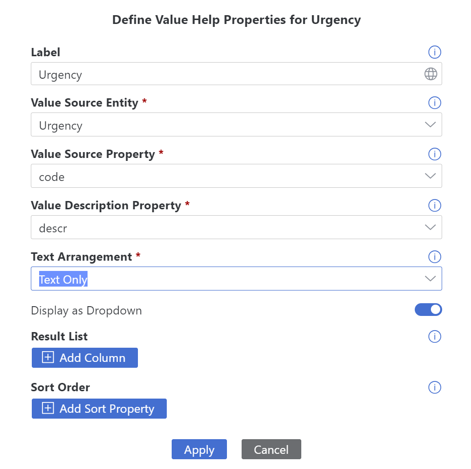

# Exercise 3 - Create a List Report UI Application
---

After creating a service with several entities, we will now create a list report with an object page, based on the SAP Fiori elements technology.

## Create a New UI Application

Go back to the **Storyboard** tab in SAP Business Application Studio.<br>
In the **UI Applications** tab, click + (Add UI).<br>
The UI Application wizard opens.<br>

In the **Display Name** field, enter **Incidents**.<br>
From the **Data Source** dropdown list, select **ProcessorService**.<br>
Click **Next**.<br>


You can choose the technology you want to use to create your new UI app. You have a choice between a Template-based, responsive application" representing SAP Fiori elements (FE), and a "Mobile-centric, freestyle application" representing the Mobile Development Kit (MDK).

For the **UI Application Type**, click the **Template-Based, Responsive Application** tile, and then click **Next**.

Here's some background that you can choose to skip:
Both UI application types create responsive apps that can be used on mobile devices and on desktops. However, FE users would rather start with desktops and MDK apps rather than with mobile. Both adhere to the templates, however, in the MDK case, it is a template that can be changed in whichever way the user wants. FE is more restricted with respect to changes to the template.  However, the resulting app always adheres to the newest SAP Fiori guidelines and comes with a lot of functionality out-of-the-box.


For the **UI Application Template**, click the **List Report Page** tile, and then click **Next**.


For the **Data Objects** step, fill in the following:

From the **Main entity** dropdown list,	select **Incidents**.<br>
From the **Navigation entity** dropdown list, select **None**.<br>
Click **Finish**.<br>


And there you go, with just 4 steps you have created a complete UI app on top of your service entity. After a few seconds, the new UI app is displayed in the **UI Applications** tile of the **Storyboard** tab.<br>
After some more seconds, the **Page Map** editor pops up on the side, showing the pages that were generated for the UI app.


We now have a fully functional list report and an object page. Both pages are automatically populated with all the fields from our Incidents service entity, except for the ones that don't make sense. For example, the ID field that contains a UUID is not included, since showing UUIDs does not make for a good user experience.

While we could now already start testing our UI application and would get a nice application, we will first optimize the UI in a couple of places.

## Adjust the List Page of Your UI Application

From the **Page Map** editor, select the **List Report** tile, and click the **Configure Page** pencil icon.


You can now see the details of this page.<br>
Expand the **Columns** section under the **Table** section, and see the properties of your service entity. It should look like this:


Click on **urgency_code**, and make the following updates on the right:

1. Change the **Label** to **Urgency** and click **Enter** to make the label look better. 

2. From the **Text** dropdown list, select **urgency/descr**.

3. From the **Text Arrangement** dropdown list, select **Text Only**. This will configure the list to show the description of the urgency instead of its code.


Under **Table > Columns**, select **customer_BusinessPartner**.

Change the **Label** to **Customer** and press **Enter** to make the the label look better.

 

Select **Table**.<br>
From the **Initial Load** dropdown list, select **Enabled**.

This enables an initial load of data so that you do not need to click the **Go** button to load it.

 

## Adjust the Object Page of Your UI Application and Add Value Helps

Click **Page Map** on the upper part of the editor to go back to the page map.<br>
Select the **ObjectPage** tile and click the **Configure Page** pencil icon.


Select the **Header** section. <br>
From the **Title** dropdown list, select **title**, so that the incident title appears in the header.

 
 
Under the **Sections** section, select **General Information** to update the urgency and customer fields with label and value help.

From **General Information > Form > Fields**, select **urgency_code**.<br>

Then, in the panel that opens on the right, in the **Label** field, change the text to **Urgency**, and then press enter.<br>
From the **Text** dropdown list, select **urgency/descr**. <br>
From the **Text Arrangement** dropdown list, select **Text Only**. <br>
From the **Display Type** dropdown list, select **Value Help**.<br>


The **Define Value Help Protperties** dialog box opens.

In the **Label** field, enter **Urgency**.<br>
From the **Value Description Property** dropdown list, select **descr**.<br>
From the **Text Arrangement** dropdown list, select **Text Only**.<br>


Leave the **Display as Dropdown** option switched on, and click **Apply**.<br>



Now we will carry out similar steps for the customer column.<br>
Only this time we will create a value help instead of a dropdown list because we expect the list of customers from the backend to be too huge to handle in a dropdown.<br>

From **General Information > Form > Fields**, select **customer_BusinessPartner**.<br>

In the panel that opens on the right, in the **Label** field, change the text to **Customer**, and press Enter.<br>
From the **Text** dropdown list, select **customer_BusinessPartner**. <br>
From the **Text Arrangement** dropdown list, select **Text Only**. <br>
From the **Display Type** dropdown list, select **Value Help**.<br>


[](/exercises/Ex7/images/customercolumnpage.png)

The **Define Value Help Protperties** dialog box opens.<br>
Switch off the **Display as Dropdown** option.<br>
Click **Add Column**.<br>
From the **Property** dropdown list, select **FirstName**.<br>  
Click **Add Column**.<br>
From the **Property** dropdown list, select **LastName**.<br>
Click **Apply**.<br>


## Add the Conversations Section to the Object Page

Now we will add the **Conversations** section next to the **General Information**.<br>

Select **Sections**, click + (Add Sections), and select **Add Table Section**.<br>

The **Add Table Section** dialog box opens.<br>
In the **Label** field, enter **Conversations**, and press **Enter**.<br>
From the **Value Source** dropdown list, select **conversations**.<br>
Click **Add**.<br>


Select **Conversations > Table > Columns**, click the + icon , and select **Add Basic Columns**.<br>

The **Add Basic Columns** dialog box opens.<br> 
From the **VColumns** dropdown list, select **author**, **timestamp**, and **message**.<br>
Click **Add**.<br>


Close the **Page Map** editor and navigate back to the **Storyboard** tab.

## Summary
You have now added a new UI application to your project.

---

<br>

### Add Application Logic to the Application


In this exercise, we will add a logic of automatic urgency determination.
Customers may forget to select the urgency when creating an incident, so whenever an "Urgent" appears in the title, the incident will automatically be marked as urgent.

##### Update Incident from the Incident's Subject

From the **Storyboard**, select the **ProcessorService**, and click **Open in Graphical Modeler**.
The CDS Graphical Modeler opens.

Select the **Incidents** entity and click the **Add Logic** icon.


The **Add Application Logic** dialog box opens.
From the dialog box:

For the **Service Entity** field, make sure that the **ProcessorService.incidents** value is selected.

For the **Name** field, enter **changeUrgencyDueToSubject** for the value.

Click **Add**.


The application logic editor opens.
From the **CONFIGURATION** tab of the application logic editor, select the following options:

In the **Phase** section, select **Before**.

In the **Standard Event** section, select **Create** and **Update**.

Click **Open Code Editor > Application Logic**.


The application logic handler file opens.
In the **'changeUrgencyDueToSubject.js'** file, after the comment "//Your code here", add the following content:

```
const incident = request.data;
if (incident.title?.toLowerCase().includes("urgent")) {
      incident.urgency = {      
        code: "H",        
        descr: "High"        
      };
}
```      

The outcome should look like this:


We have now finished configuring the application and we can preview it.

##### Preview the Application

From the activity bar on the left of the page, click the **Run Configurations** icon. 

From the **Run Configurations** view, click the **Run Module** icon.


A preview of the application opens, showing the **Incidents** tile on the left.

Click the **Incidents** tile.
The list of incidents opens in a new tab.

Click the **Strange noise when switching off Inverter incident**, which has **Medium** urgency, and then click **Edit**.

Add the word **Urgent** to the beginning of the **Title** and click **Save**.

Go back to the list of incidents and see that the **Urgency** changed to **High**.


Go back to SAP Business Application Studio and click **Stop Preview** button.

##### Summary
We added application logic to the application. 

---

<br>

### Deploy Your Application


In this section, we will deploy the project to the Business Technology Platform (BTP), Cloud Foundry environment.

##### Deploy the project to BTP

We already completed the environment set up for you. This is what we did:

* Enabled the Cloud Foundry environment.
   
* Added an entitlement for SAP HANA Cloud.
   
* Added an entitlement for SAP HANA Schemas & HDI Containers.
   
* Added you as a member in a Cloud Foundry space.
   
Since these steps are completed, you can now select a space and deploy an application to the SAP BTP, Cloud Foundry environment.

Deployment is composed of 3 steps that are available from the **Task Explorer**:

1. Build an application.
   
2. Log in to the target space in the Cloud Foundry environment.
   
3. Deploy the application.
   
To start deployment:<br>

From the activity bar, click the **Task Explorer** icon.

Expand the **Deploy** section, select **Deploy incident_managementXXX**, and then click the **Run** icon.


A build starts and the **Cloud Foundry Sign In and Targets editor** opens.

- Enter the following Cloud Foundry endpoint **https://api.cf.eu10-004.hana.ondemand.com** .<br>
  **Important**: Sometimes, the system recommends the **https://api.cf.eu10.hana.ondemand.com** URL. Make sure you manually enter the **-004** part behind **eu10**.<br>

- Choose **SSO Passcode** as the authentication method.<br>

- Press the **Open a new browser page to generate your SSO passcode** link.<be>


- Next, provide the value **lcap-platform** and choose **Sign in with Alternative Identity Provider**.


This opens a new page, with a temporary passcode created for your user.

- Press the button on the right of the password to copy it to the clipboard as indicated here:


- Paste the copied passcode into the field **Enter your SSO Passcode** on the **Cloud Foundry Sign In and Targets editor** page.
- Click **Sign In**.

After a couple of seconds, the following page opens:


In this page:

- Choose the **TechEdLCAP_lcapteched** organization.
- Choose the **dev** space.
- Click **Apply**.

The deployment starts and progress can be tracked in the Terminal.
It takes **several minutes** for the application to be deployed.

##### Check the running service and UI after deployment

Once Deploy is complete, copy or click on the URL that appears at the end of the Terminal logs under **Project OverviewURL**.<br>
For example, **https://<myaccount>.launchpad.cfapps.<myregion>.hana.ondemand.com/lcapincident_managementXXX.incident_managementLaunchpad-1.0.0**


Click the **Incidents** tile to open the application with a list of incidents.

It looks very much like the preview page from the last chapter. Indeed, it is almost the same page, but now everything is deployed and runs in the BTP account. <br>


##### Summary

This concludes this hands-on. In just a few chapters, and without writing code, you have created an OData service based on CAP and a corresponding UI application based on SAP Fiori elements, which you then deployed to the SAP Business Technology Platform. Your application complies to standard designs and comes with a lot of functionality out-of-the-box.

You can continue to optional exercises to add unit tests and integrate the application to SAP Build Work Zone - [Exercise 10](../Ex9/README.md)

High productivity tools in BAS have many more capabilities that were not covered in this workshop. So, for the sake of completeness, let's have a look what else you could have done:
- Use authentications for different user roles
    - The service in our project is set up so that it can be used for any CRUD operation by users that have a user and password for the corresponding BTP sub-account. However, this is not always what you want. While some users might only have read access to our applications, others can read and write.
    - To support such scenarios, one can define authorizations for the service entities and assign different privileges for the different user roles. These roles then have to be assigned to users by an administrator after deployment.
- Share you project.
    - You can enable project sharing by assigning it to a Git repository.
    - You can then not only push your changes to the central Git repository, but you can also allow others to collaborate on the project by sharing the project with them.
    - In case of conflicts when several people work on the same project, there are simplified processes to overcome this.
- Create a mobile first application with MDK.
- Integrate your project with CI-CD using the SAP Continuous Integration and Delivery service.


