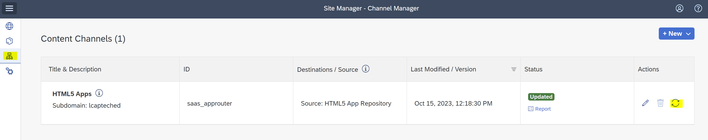
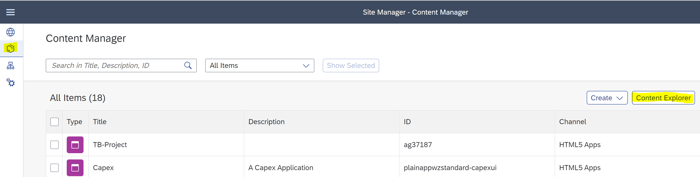
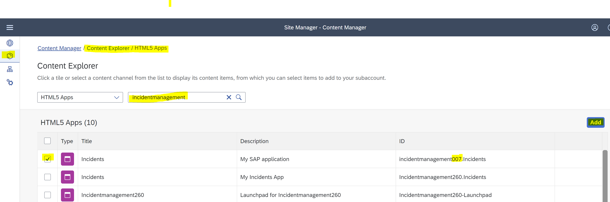
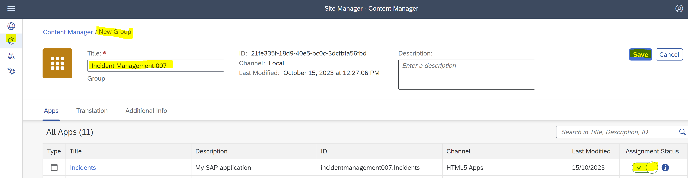
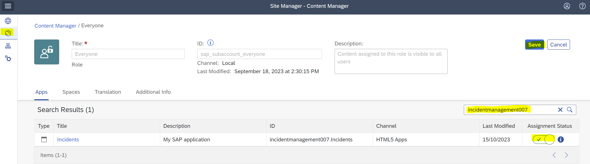
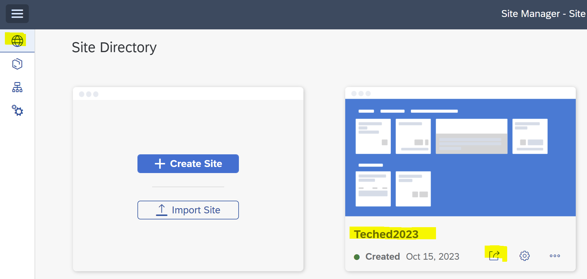
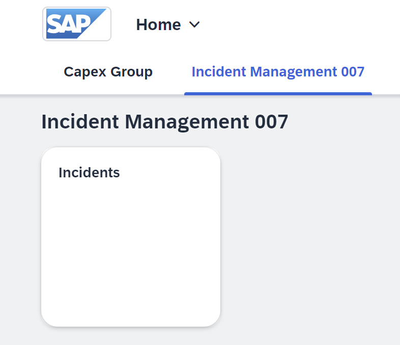

# Exercise 5 - Integrate with SAP Build Work Zone
---


In the following steps, you will add the deployed HTML5 application to a site created in SAP Build Work Zone, standard edition.

## Prerequisites

We have already performed the following steps in the SAP BTP cockpit for you:
- Added an entitlement to SAP Build Work Zone, standard edition.
- Created a subscription to SAP Build Work Zone, standard edition.
- Assigned the `Launchpad_Admin` role collection.

  
## Check the running service and UI after deplyomemnt

Copy the following URL to a new browser tab and launch SAP Build Work Zone, standard edition:

```
https://lcapteched.dt.launchpad.cfapps.eu10.hana.ondemand.com
```

From the activity bar, click the **Channel Manager** icon.<br>
For the **HTML5 Apps** channel, click the **Update content** icon.



The deployed application is updated in the **HTML5 Apps** channel.

From the activity bar, click the **Content Manager** icon.<br>
Click **Content Explorer**, and then click the **HTML5 Apps** tile.



Search for the **incidentmanagementXXX** application where **XXX** corresponds to your project suffix.

Verify that the **ID** column ends with **XXX.Incidents**.<br>
Select the checkbox for your application.<br>
Click **Add**.

The application is added to your **HTML5 Apps** content.



Go back to the **Content Manager**.<br>
Click **Create > Group**.

The **New Group** editor opens.

In the **Title** field, enter **Incident Management XXX**, where **XXX** corresponds to your project suffix.<br>
In the **All Apps** list, search for the **incidentmanagementXXX** app.<br>
Use the toggle in the **Assignment Status** column on the right to assign the application to the group.<br>
Click **Save**.

A group is added to your content.



Go back to **Content Manager**.<br>
Search for the **Everyone** role.<br>
Click on the **Everyone** role. A new editor opens.<br>
Click **Edit**.<br>
Search for the **incidentmanagementXXX** app, where **XXX** corresponds to your project suffix.<br>
Use the toggle in the **Assignment Status** column on the right to assign the application to **Everyone**.<br>
Click **Save**.

The application can now be viewed by everyone.



From the activity bar, click the **Site Directory** icon, and select the **Teched2023** tile.<br>
Click the **Go to site** icon. 



Click the **Incident Management XXX** tile, where XXX corresponds to your project suffix.
Your application is launched in a site.



## Summary

You have integrated your deployed application to Work Zone.
