# Exercise 8 - Create App with SAP Build Code and Joule copilot

---

### Overview
In this unit, we want to create a customer loyalty program application. Customer can get bonus points for their purchases of products and can redeem these points.

Generative AI powered Development using Joule in SAP Build Code.

1. Data Model and Service Creation
1. Sample Data
1. Application Logic

 
 

**Introduction to SAP Build Code**

SAP Build Code is a turn-key development environment that combines runtime and design time capabilities with built-in solutions for DevOps and Application Lifecycle Management.

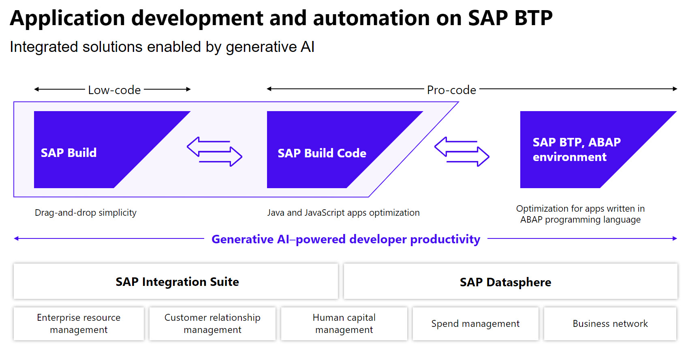

**Benefits of SAP Build Code**

* Achieve a clean core by developing side-by-side extensions with SAP Build Code
* Optimize developer efficiency with generative AI, productivity tools, and application lifecycle management
* Enable developers to build and extend powerful end-to-end business applications with programming language of choice
* Leverage interoperability between classic development and low-code development tools

**Key capabilities of SAP Build Code**
* Differentiate cloud solution with stable and future-proof foundation, solution becomes future proof and works with different editions of S/4HANA, and quality assurance options included
* Enable developers to code faster and smarter, code generation based on generative AI, Ease of Application Lifecycle Management
* Application and extension development, Integrate with SAP and non-SAP systems
* Easy access for all types of developers with centralized Lobby, for Fusion Development

### Create Project

The starting point for this tutorial is the lobby of SAP Build, the central entry point for all SAP Build products.

1. Launch the SAP Build Lobby (if you are not already in the Lobby)
2. Click on the Create button

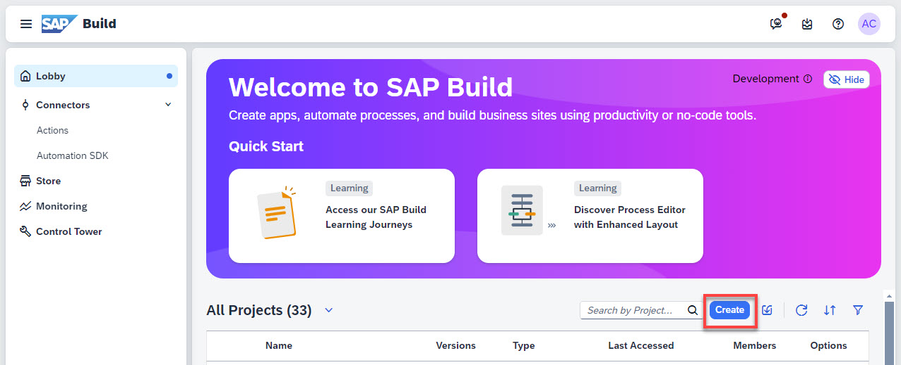

3. Select Build an Application

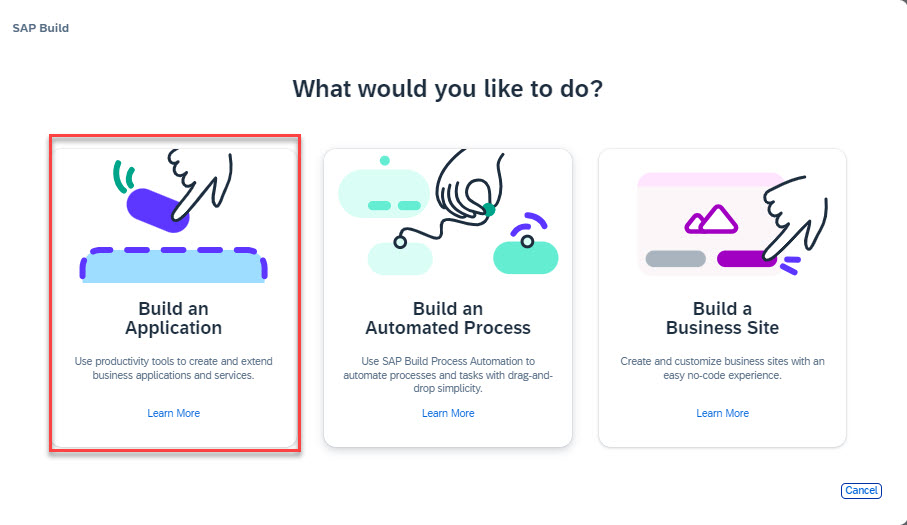

4. Select SAP Build Code

  

5. Select Full-Stack Application

6. On the next screen, enter the following:

|  Input Field   |                      Input Value                       |
| -------------- | ------------------------------------------------------ |
| Project Name   | Customer_Loyal_AC87395U01                              |
| Description	 | Customer Loyalty Program Model and Services AC87395U01 |

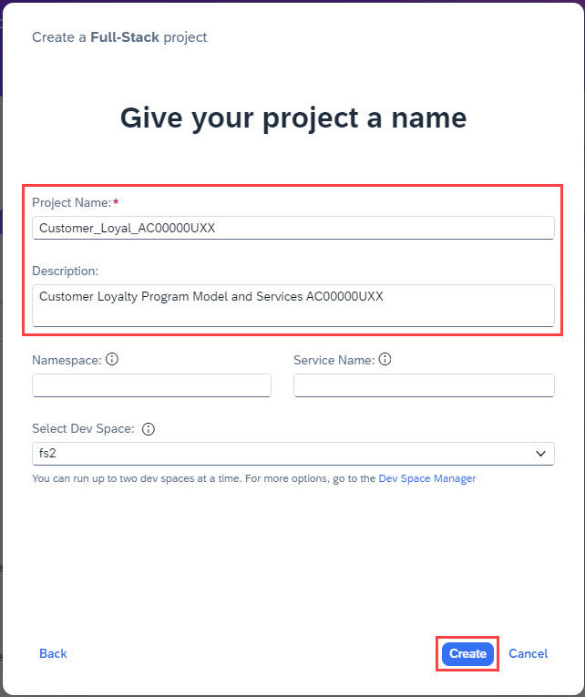

7. Click the Create button.

* The creation of the project can take up to 1 minute.

8. Click on the Customer_Loyal_AC87395U01 project.

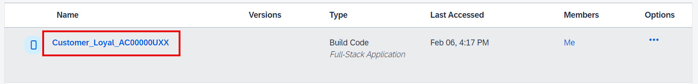

9. You might be asked to confirm the cookies settings by clicking OK (or Open Settings to update the settings)

10. SAP Build Code will be opened, based on SAP Business Application Studio - in the background.

* Please allow some time for SAP Build Code to open!
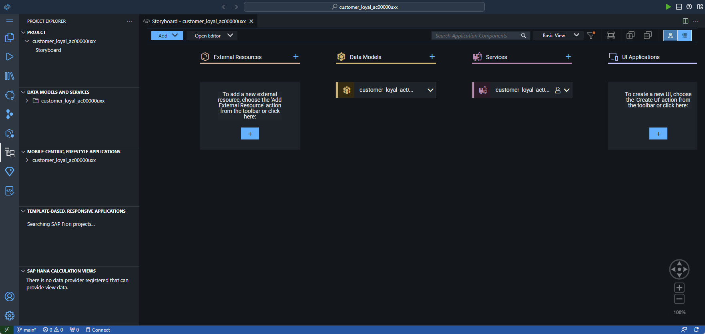

---

### Create Data Entities with Joule

In this lesson, we will create the data model and the services for the customer loyalty program application.

We could create the data model visually from the Storyboard or by writing the code manually. However, we are going to use the generative AI capabilities of Joule and SAP Build Code to generate the code. Thus, significantly reducing the time and effort required to develop the customer loyalty program application.

1. Launch the Joule digital assistant.

* Please wait for the digital assistant to open. If it fails to open then please refresh your browser.

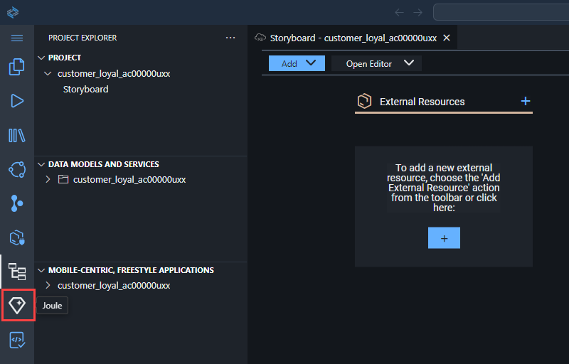

2. Click on Open Guide > Data Model and Service Creation.
1. Click Open Joule

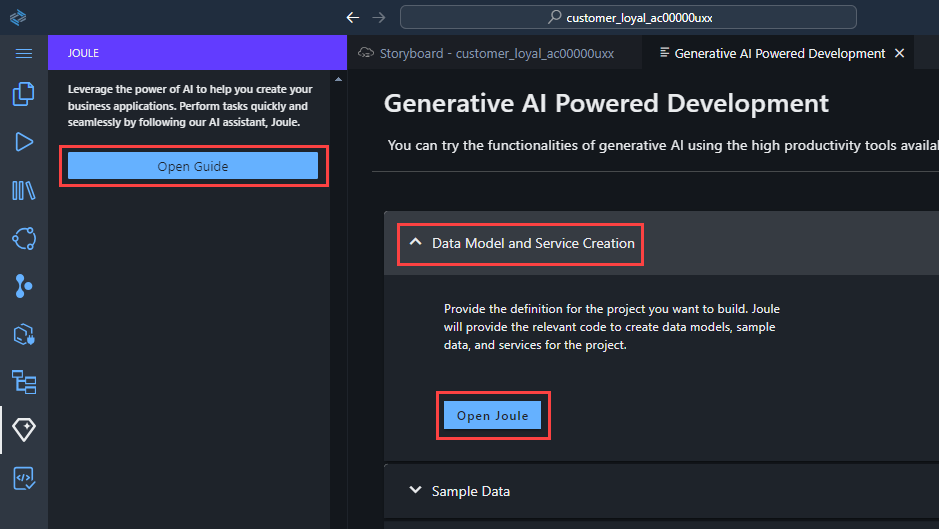

4. Generate the data model and services by copying and pasting the prompt into the box where it says ‘Ask Joule’.

>   
> Design a customer loyalty program application. Define 3 data entities: Customers, Purchases and Redemptions. Each customer must have the following fields: name, email, 7-digit customer number, total purchase value, total reward points, ‘total redeemed reward points’. All fields for each customer should be integer except name and email that will be stored as string. Purchases should include the following fields: purchase value, reward points and selected product. All fields in Purchases must be integer except selected product. Redemptions must have 1 field in integer: redeemed amount. Each purchase and redemption will be associated to a customer. Create 5 rows for each entity.
>   

5. Click Generate.

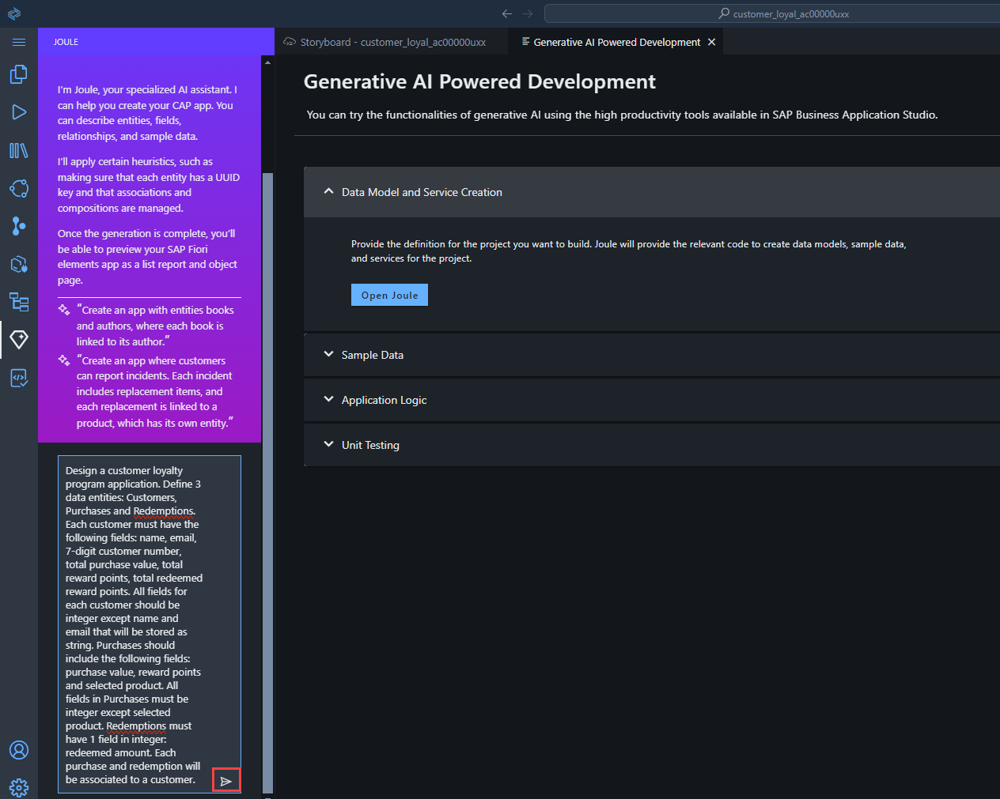

6. The code should be generated now below your prompt.

7. Accept the Code by clicking the Accept icon.

* Once you accept the code, you will see the update on the right side under the Storyboard tab.
* It can take up to 2 minutes for Joule to create the data models and services for you.

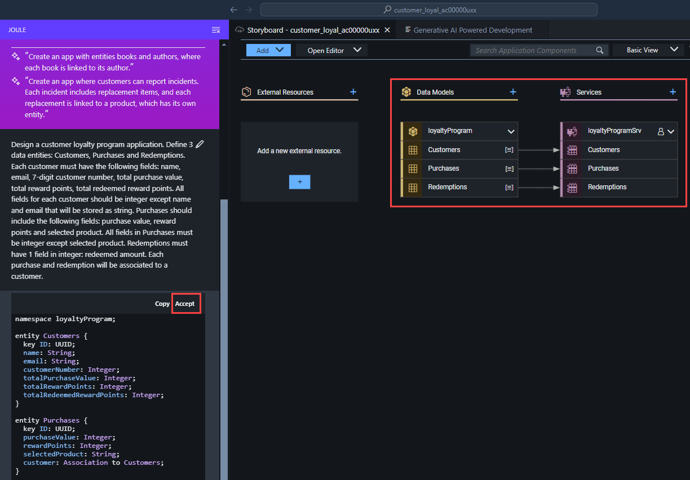

---

# Enhance Sample Data with Joule

In this lesson, we are going to use the generative AI capabilities of Joule and SAP Build Code to generate some sample data. This sample data will be used to test and preview the backend service of our customer loyalty program application.

### Enhance Customer Sample Data
1. Open the the Sample Data Editor in the Storyboard, by selecting Open Editor > Sample Data.

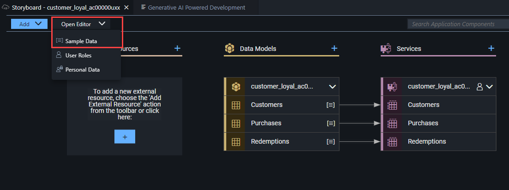

2. Select Customers data entity then click Enhance.

* This will open again Joule to modify the sample data.

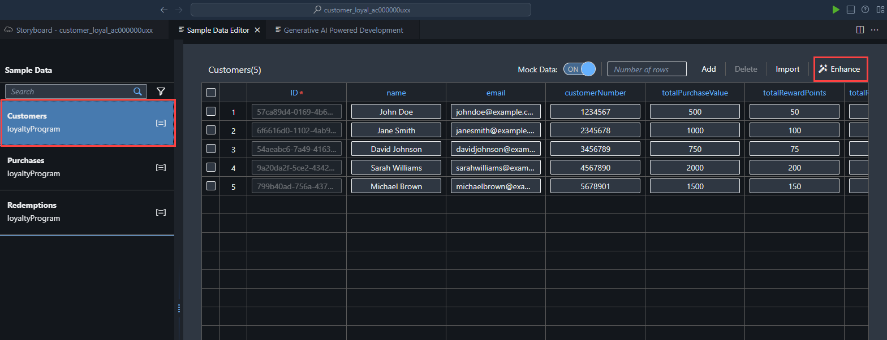

3. Copy and paste the following Prompt into Joule and click Generate:

> Enhance my sample data with meaningful data. All customer numbers will be 7 digits and one customer must use the customer number 1200547. No field may be empty. Total purchase value must be smaller than 10000. Total reward points and total redeemed reward points both must be unround and different and always sum to one-tenth of total purchase value for each customer.

* Below your prompt, you can see the customer names, email adresses and purchases are created.

4. Accept the code created by Joule.

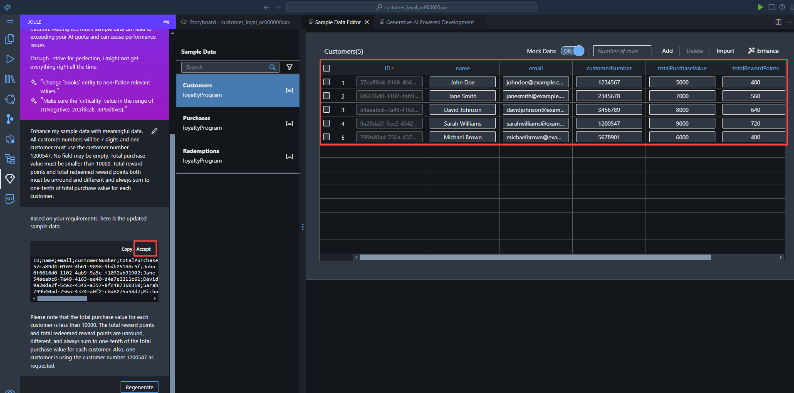

5. You see that the customer Number of one of the customers in the list has been updated to 1200547.

* This is required for demo purposes. Later in the workshop, we will be scanning a customer Loyalty Card that will have a barcode with this number. Thus, we will be able to retrieve exactly this record from the data entity.

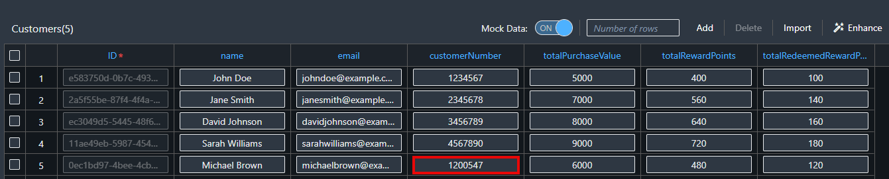

### Enhance Purchases Sample Data

1. Select the Purchases data entity.
1. Enter 5 into the Number of Rows field beside Mock Data
1. Click the Add button to add 5 more rows to the entity.

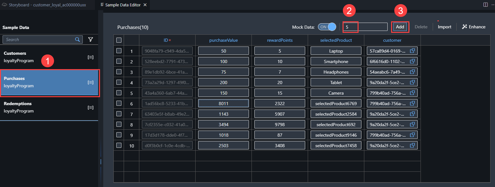

4. Click Enhance.

1. Copy the following text for the Prompt in Joule

> Enhance my sample data with meaningful data using electronic office products. Each ‘purchaseValue’ will be between 50 and 1000. Ensure that each ‘rewardPoints’ is always one-tenth of the ‘purchaseValue’. Ensure that the ‘customer’ field is populated.

6. Paste the copied text into the Joule prompt, click Generate.

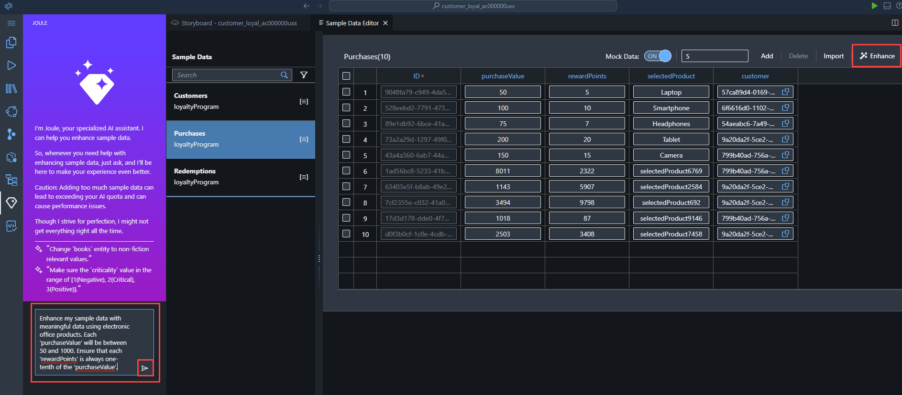

* Wait for Joule … Thinking … and the data to be generated. The AI generation may take a little while.

7. Accept the code created by Joule.

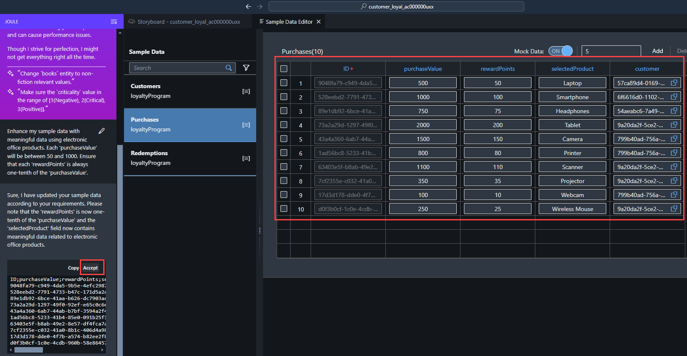

### Enhance Redemptions Sample Data

1. Select Redemptions data entity.

1. Click on Enhance.

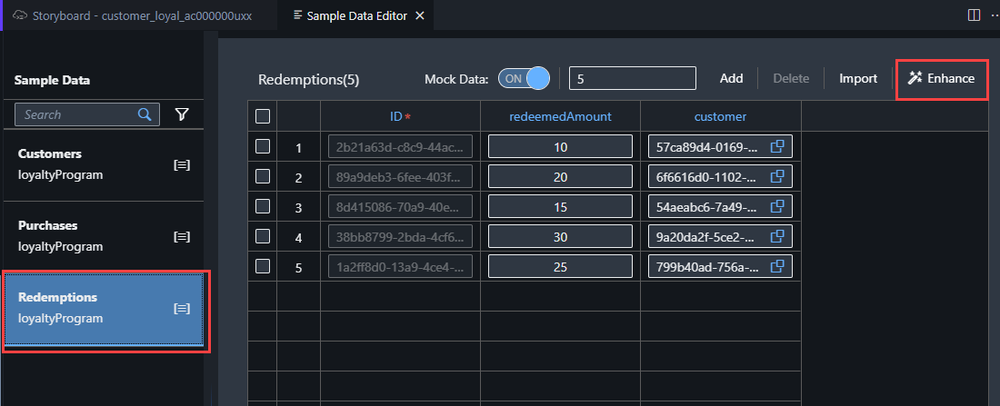

3. Use the following Prompt in Joule:

> Ensure that each redeemed amount is different and between 10 and 100.

4. Click Generate. This may take a little time.

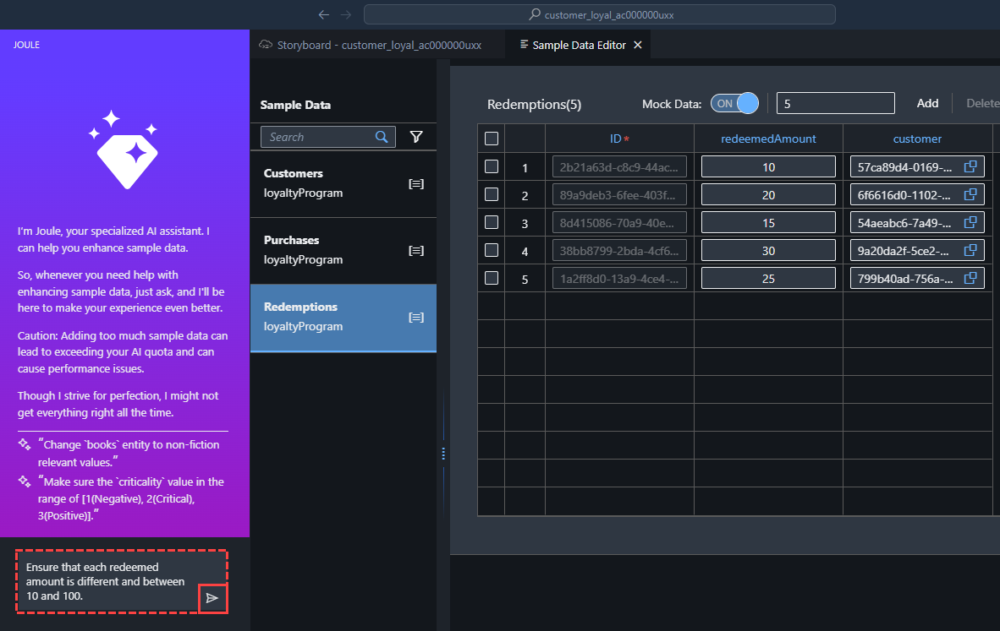

5. Accept the code created by Joule.

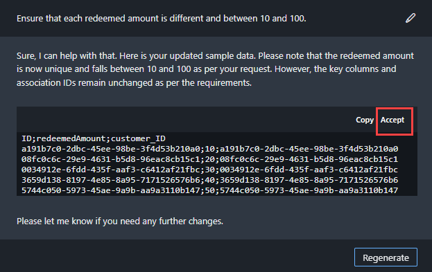

6. You should see the following after clicking Accept.

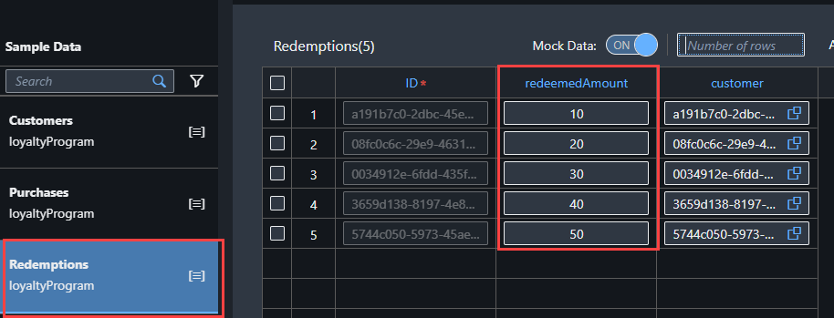

---

# Create Backend Logic with Joule

We have already created the entities, services and sample data with Joule. In this lesson, we will add some logic to our application. We would like to calculate the bonus points for each customer purchase. Additionally, we want to provide the logic for customers to redeem their bonus points.

### Purchases Backend Logic
1. In the Storyboard, click on one of the entities under Services and Open in Graphical Modeler

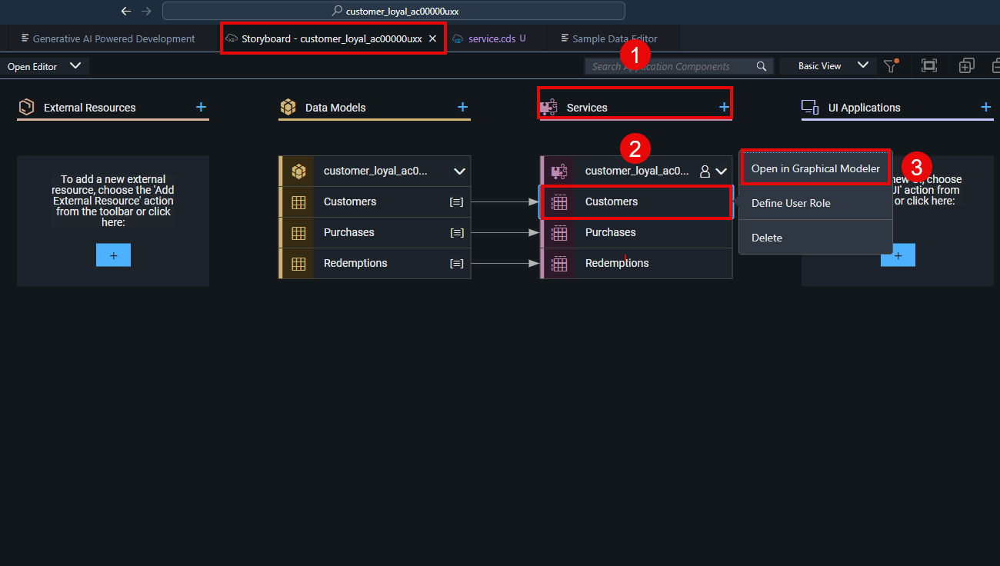

2. Select Purchases entity by clicking on the title.

* Note: if you can not see the Purchases entity you may have to zoom out the view.
3. Click on Add Logic.

4. Leave everything by the default value and click on Add

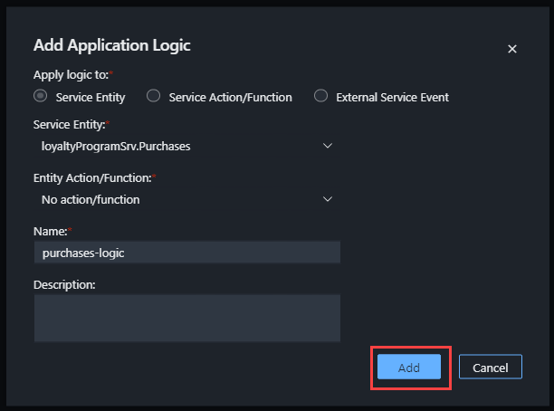

5. Select the Standard Event Create.

* That means this logic will be automatically executed if a new purchase is done.
6. Go to Open Code Editor > Application Logic.

* This will open Joule again to create the logic for us.

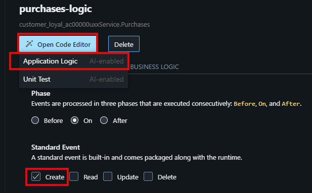

7. Use the following Prompt in Joule to create a backend logic:

> Reward points of each purchase will be the one-tenth of the purchase value. Each purchase value will be added to the total purchase value of the related customer. Each reward points will be added to the total reward points of the related customer.

8. Click Generate.

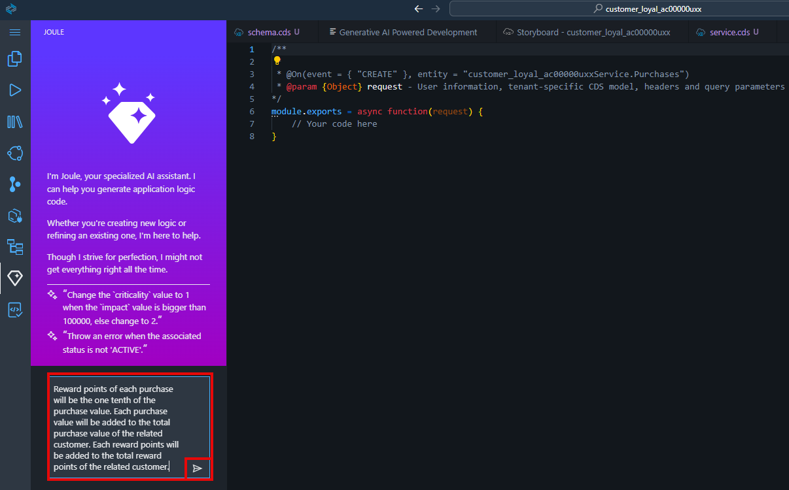

9. Joule created the following logic:

* Check if the customer exists
* Calculates the rewardPoints from the purchase value
* Updates the total purchase value and the total reward points in the customers entity
10. Accept the code created by Joule.

* Joule might generate different codes for the same prompt. So, you might have a different code for the backend logic which is completely fine if it does the same job. You can ignore this and keep working on the exercise.

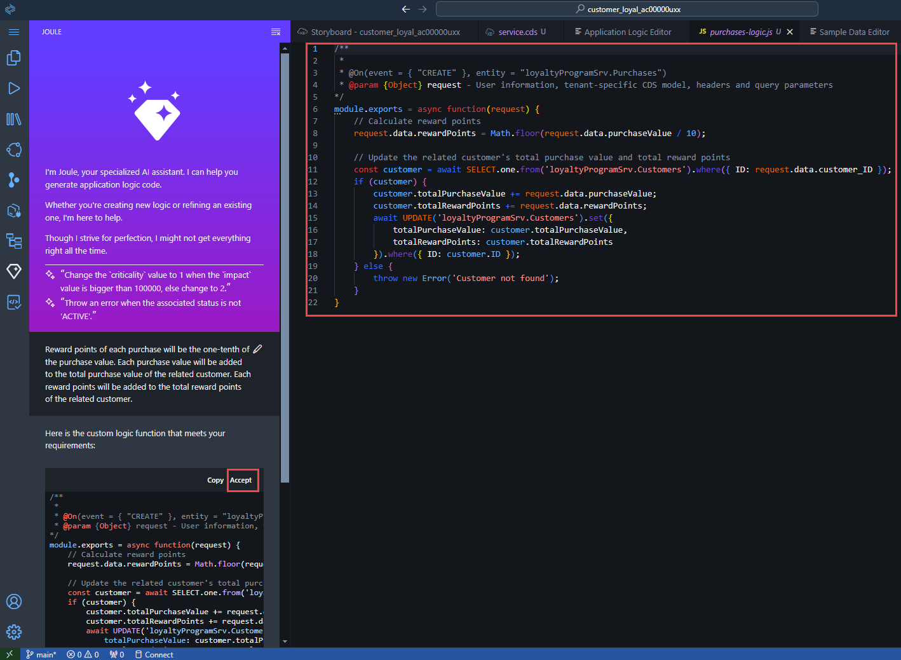

### Redemptions Backend Logic
Now we continue with the Redemptions.

1. Go back to service.cds tab.

1. Select Redemptions entity by clicking on the title.

1. Click on Add Logic.

4. Click Add.

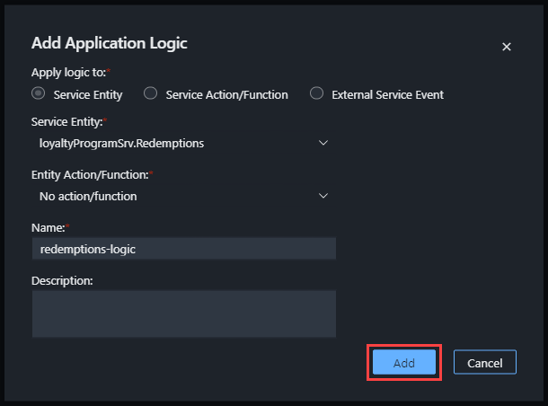

5. Select Create.

1. Go to Application Logic under Open Code Editor

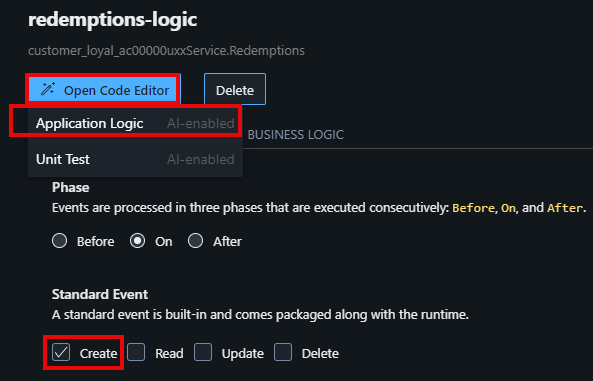

7. Use the following Prompt in Joule to create a backend logic:

> Deduct the redemption amount from ‘totalRewardPoints’ of the related customer. Add the same redemption amount to the ‘totalRedeemedPoints’ of the related customer.

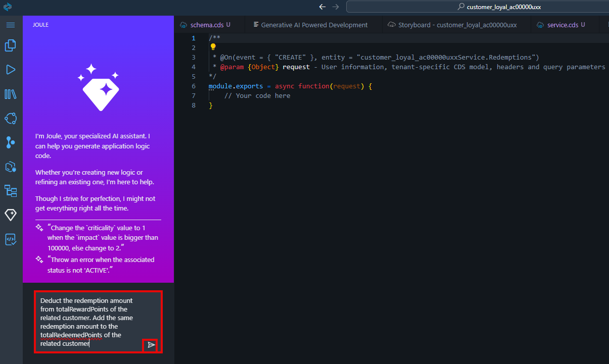

8. Accept the code created by Joule.

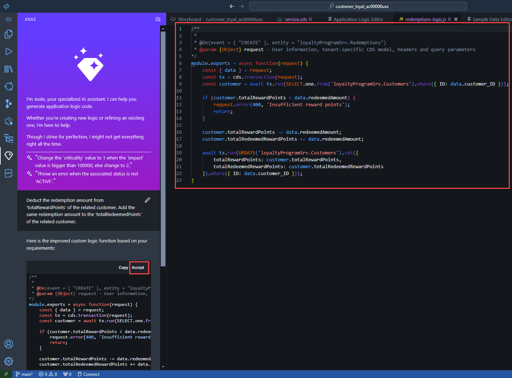

* Have a closer look at the generated code. It includes some logic to check if a customer has enough points for the redemption.

* Joule might generate different codes for the same prompt. So, you might have a different code for the backend logic which is completely fine if it does the same job. You can ignore this and keep working on the exercise.

9. Go back to Storyboard and open Service Center.

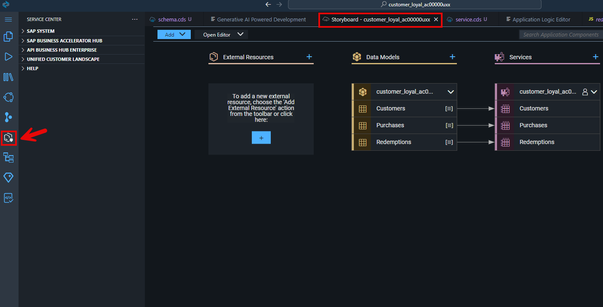

---

### Add External Data Resource

In this lesson, we will connect to an S4/HANA system to retrieve the product related data.

1. In Service Center go to SAP System and find the BTP destination S4HANA_Joule_Product (S/4 Product).

1. Click Add to CAP

Note: This destination is already configured by your subaccount admin. The destination is connected to a Sandbox API from SAP Business Hub. For more information about the api go to the SAP Business Accelerator Hub: https://api.sap.com/api/API_PRODUCT_SRV/overview

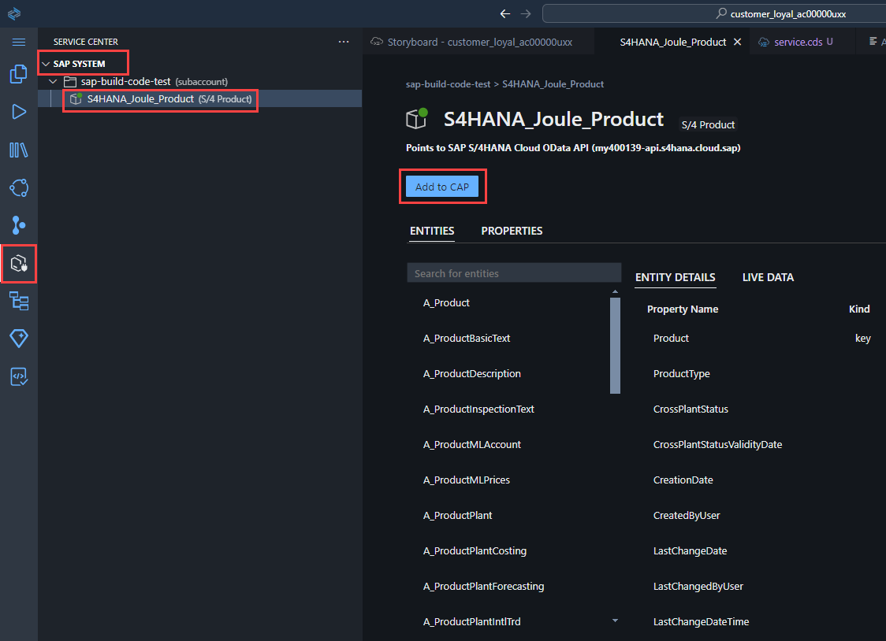

3. Go to Storyboard and check if the External Resource got updated.

Note: It may take a short time to update!

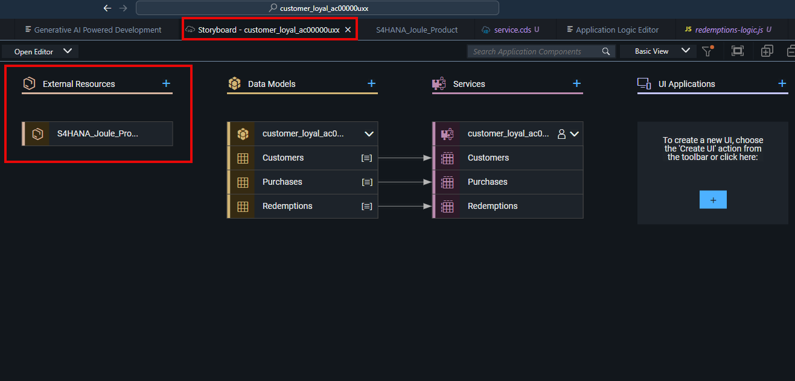

4. Go to service.cds tab and Add Entity

* You can drop the new entity anywhere

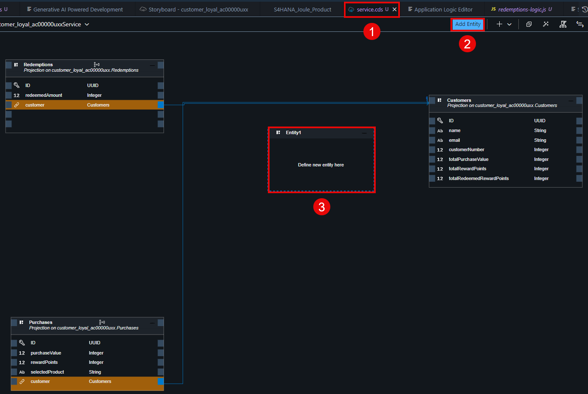

5. Select the data entity: S4HANA_Joule_Product.A_ProductBasicText

* Disable the Enable draft editing option.

6. Click Save

---

### Preparation for the SAP Build Apps Integration
If you want to create a customized UI with SAP Build Apps on top of it, we need to adjust some settings in the service.

To do this, we will use the Graphical Modeler to disable the “Draft Editing” mode for all three entity sets:

* Customers
* Purchases
* Redemptions
1. Select the Redemptions entity and the Redemptions details will appear on the right hand side.

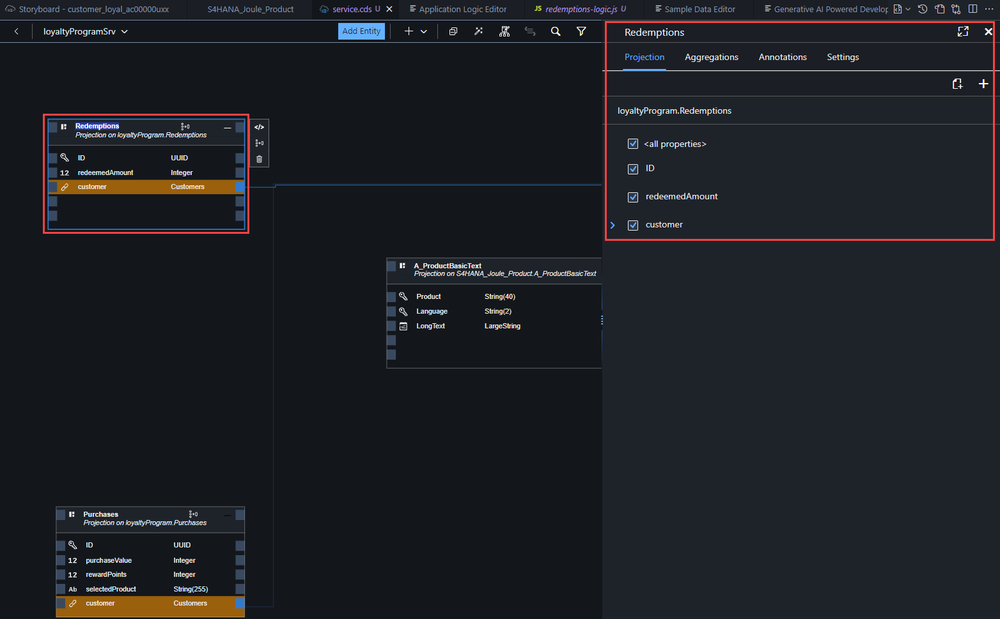

2. Select Settings => Disable Draft Editing.

* If you do not see Settings may have to move the Show Details content to the left

3. Select Customers and disable Draft Editing

* You may have to move around to find Customers.

4. Select Purchases and disable Draft Editing

---

### UI Application
In this lesson, you will create a UI to display and test the content that we have already created for the customer loyalty program application.

1. Go back to the Storyboard and add a first UI application by clicking on the (+)

2. We will start with the user interface for the data entity Purchases. Enter the following values:
* Display name: Purchases
* Description: Manage Purchases
* Data Source: loyaltyProgramSrv

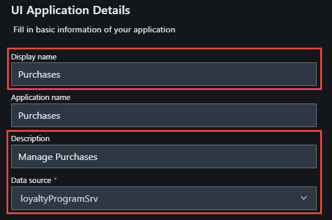

3. Click Next

4. Select Template-Based Responsive Application as the UI Application type.

5. Click Next

6. Select List Report Page

7. Click Next

8. Select the Purchases entity

1. Click Finish

10. Close the Page Map if needed.
You can repeat the same steps with the Customer and Redemption entity.

Customer:

* Display name: Customers
* Description: Manage Customers
* Data Source: loyaltyProgramSrv
* UI Application type: Template-Based Responsive Application
* UI Application Template: List Report Page
* Main Entity: Customers

>    
> Wait for the UI to create.
>    

Redemptions:

* Display name: Redemptions
* Description: Manage Redemptions
* Data Source: loyaltyProgramSrv
* UI Application type: Template-Based Responsive Application
* UI Application Template: List Report Page
* Main Entity: Redemptions

> Wait for the UI to create. You shoud see a message, that the files have been generated.

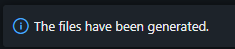

### Modify the UI for the Purchases
Now we are going to modify the UI for the purchases. We will include the products from S/4HANA as value help in the purchases and hide some fields.

1. Go back to the Storyboard.

1. Select the Purchases UI and open it in the Page Map.

* To see which is the Purchases UI, move mouse pointer over the UI to extend the displayed name.

3. We want to modify the Object page. Therefore click on the edit icon

4. In the Sections, expand General Information then expand Form and then expand Fields.
* Afterwards it will look like this:

> The reward points are calculated automatically by the logic Joule has created for us.

5. Delete the Reward Points field by pressing the trash bin icon next to it and Confirm the deletion.

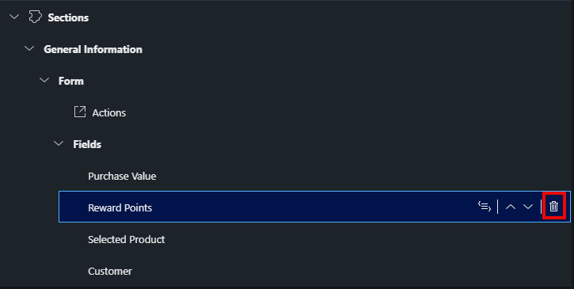

Instead we want to select the products from S/4HANA for the purchases.

6. Click on the field Selected Product and change the Display Type in the properties on the right side to Value Help.
Set the following:

* Label: Product
* Value Source Entity: A_ProductBasicText
* keep the rest as it is.
7. Click Apply

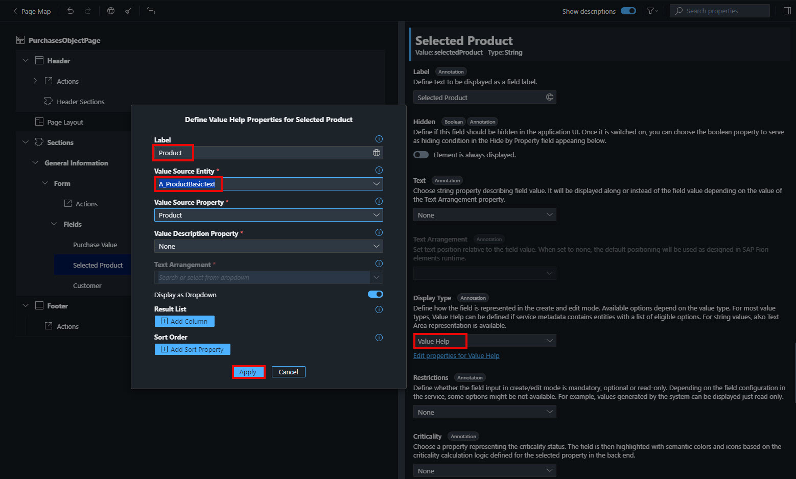

---

### Deployment
The last step in SAP Build Code is to deploy the application to CloudFoundry. This includes also that destinations are created automatically that the ODATA services can be consumed also by other tools like SAP Build Apps.

1. For the deployment go to Task Explorer and click on the Play icon (Run) next to Enable Discovery and Deploy option.

* Please be patient as this may take a few minutes.

2. Check if the task has launched in the terminal

3. During the deployment a new page will be opened to to sign into Cloud Foundry.

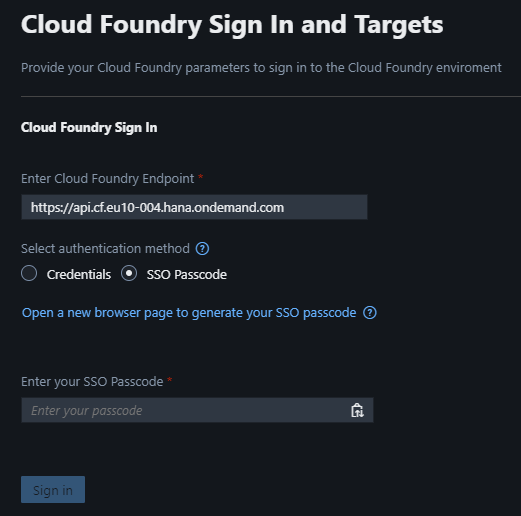

4. Please note that this is a shared landscape so we need to minimise the size of your application. Before deploying the application to Cloud Foundry, we need to set the memory footprint of the application.

* Click on the EXPLORER icon and open the mta.yaml file.

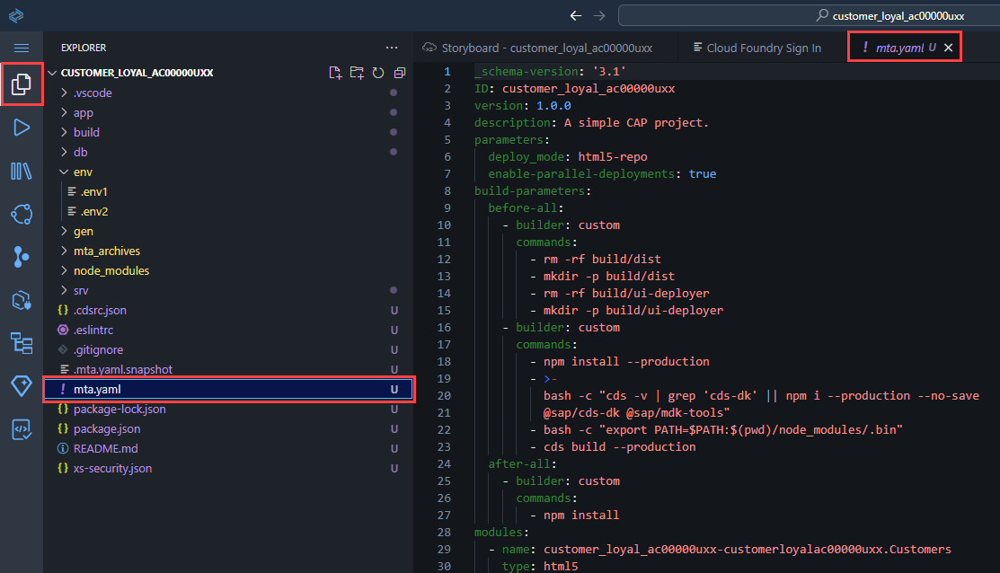

* Search the memory parameter of your application and change the value to 64MB.

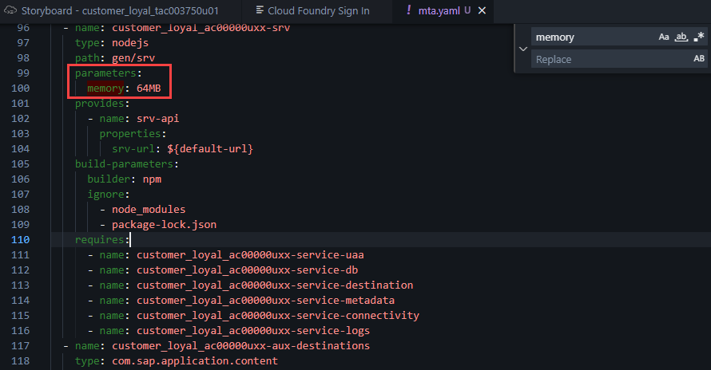

* Right click on the mta.yaml file and click Build MTA Project

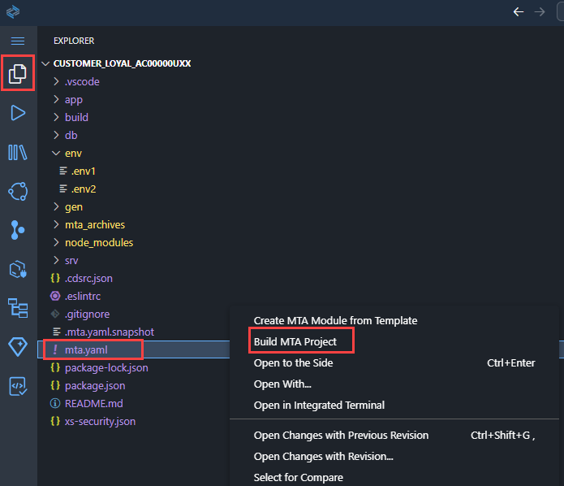

* When the job is complete, you will see the following message in the Terminal.

5. Return to the Cloud Foundry Sign In and Targets page.

* Endpoint: https://api.cf.eu10-004.hana.ondemand.com

* Click on Open a new browser page to generate your SSO passcode

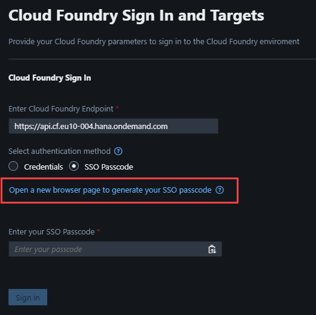

6. Enter academy-platform and click Sign in with alternative identity provider.

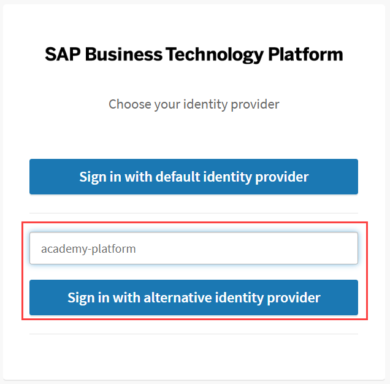

7. Copy the Temporary Authentication Code.

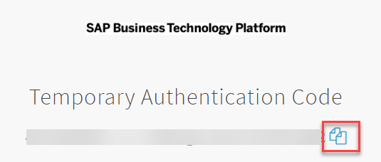

8. Paste the Code and Sign In.

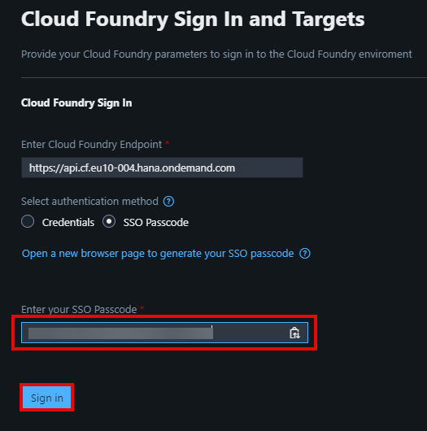

9. Select the Organization EU10 or US10 and Space.

* Organization: sap-build-code-eu10
* Space: AC_SAPBUILD
* Press Apply

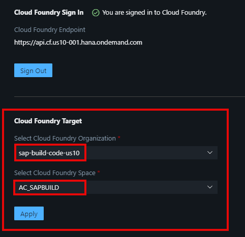

> After the successful deployment (May take several minutes) you will find the link of the deployed application in the terminal.

10. Use Ctrl+click to try it out!

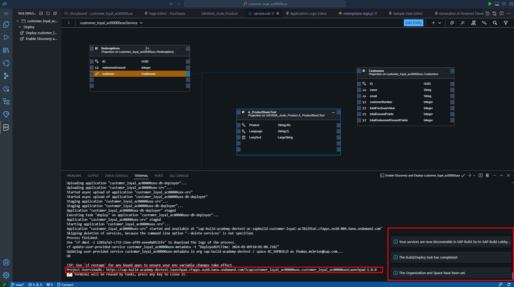

---

11. Explore the UIs that you have created

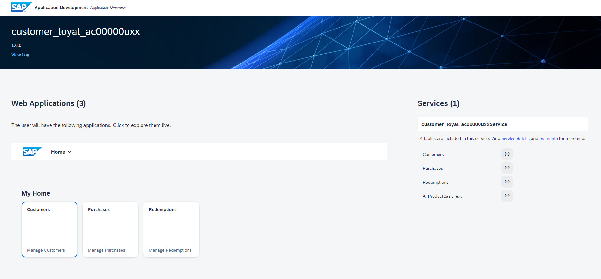

12. Click on Go in each of the tiles (Customers, Purchases. Redemptions) in the Customer Loyal UI to see the generated data.

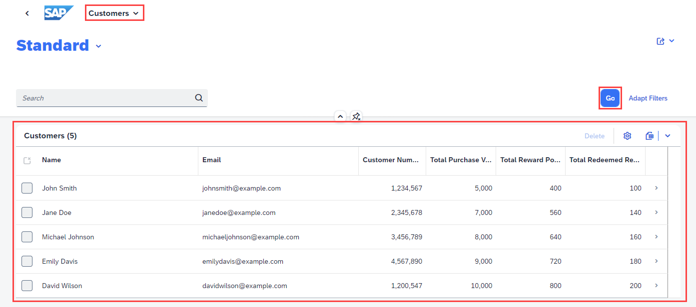

Congratulations! You have used the generative AI capabilities of Joule in SAP Build Code, to create a CAP service for a customer loyalty program application.