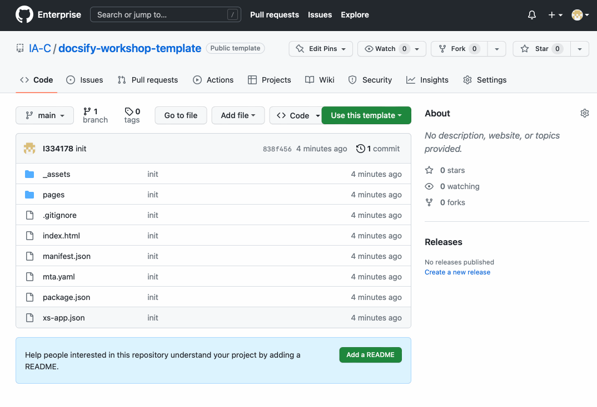

# Use this repository as a template for your workshop

If you have already some content, or you are thinking of starting to write a workshop (or a step by step guide or any kind of website), start here.

Instead of starting a blank repository, you can copy the repository for this website, to get all the heavy-lifting done for you.

Here is how you do it:

1. Go to the repository page in GitHub: https://github.tools.sap/IA-C/docsify-workshop-template

2. Click the `Fork`button at the top, set the owner an give it a new name

    

> [!TIP|icon:fa-solid fa-check|label:Congratulations]
> You have now your own repository to work on your content! There is a few things to set up, so continue to the next page.