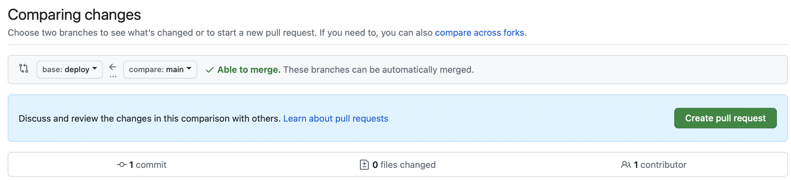

# Auto deployment

Check with Pedro to set up auto-deployment. This will be a one-time task that will allow you to update the exercise at your convenience and deploy it without any intervention. This is done using the concepts of [branches](https://docs.github.com/en/pull-requests/collaborating-with-pull-requests/proposing-changes-to-your-work-with-pull-requests/about-branches) and [pull requests](https://docs.github.com/en/pull-requests/collaborating-with-pull-requests/proposing-changes-to-your-work-with-pull-requests/about-pull-requests) of git and GitHub.

The flow to update the exercise is the following:

1. Make the changes you need in the `main` branch

2. Create a pull request to bring the changes from `main`to `deploy`:

    1. Go to _Pull requests_
    2. Click on _New pull request_
    3. Set the direction: `deploy`<- `main`. Click _Create pull request_
        
    4. Add a title (if empty) and click _Create pull request_
    5. Click _Merge pull request_
    6. Click _Confirm merge_

The deployment process will start.

The time it takes to deploy depends on the amount of content (pages, images), usually is between 1 and 2 minutes. For very heavy workshops it can take up to 15 minutes.

You can check the deployment progress in our [Jenkins instance](https://jenkins.c-8bbd345.kyma.ondemand.com).

> [!TIP]
> After deployment, delete the cache if you can't see the updates

TO BE EXPANDED